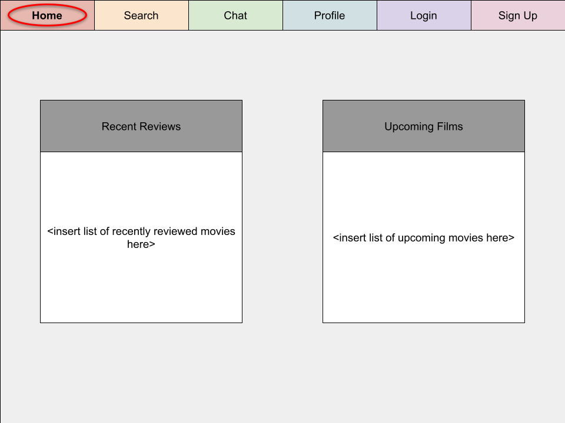
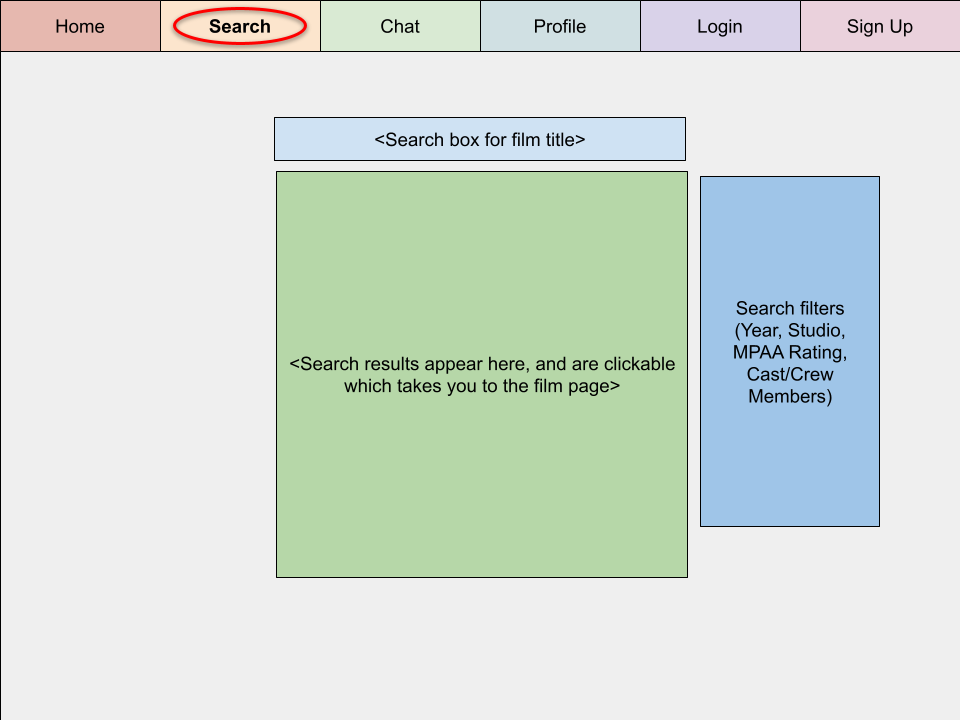
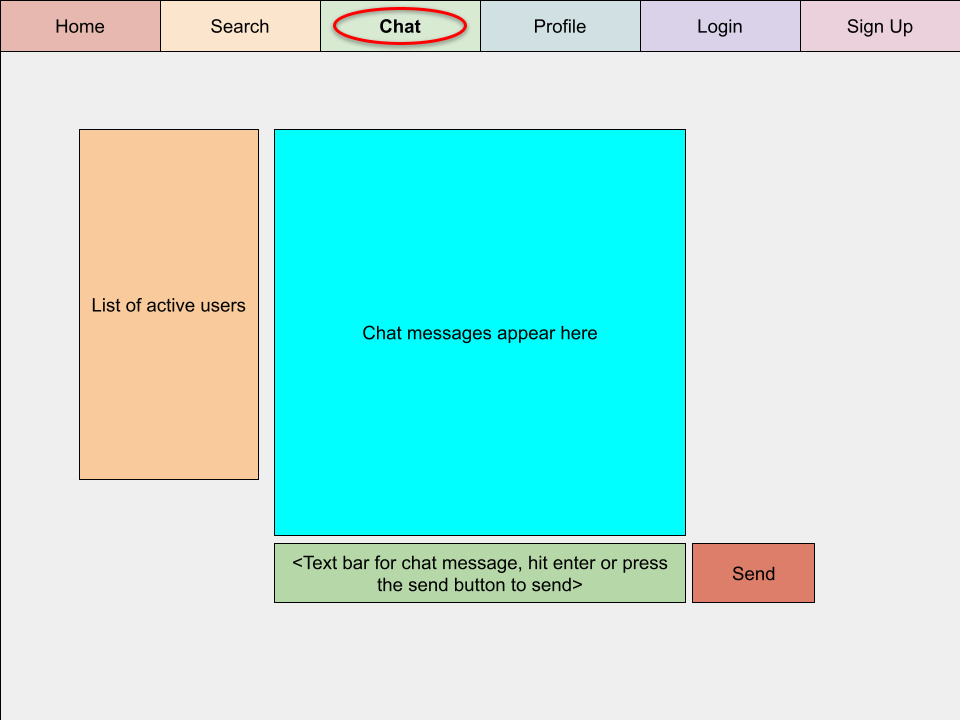
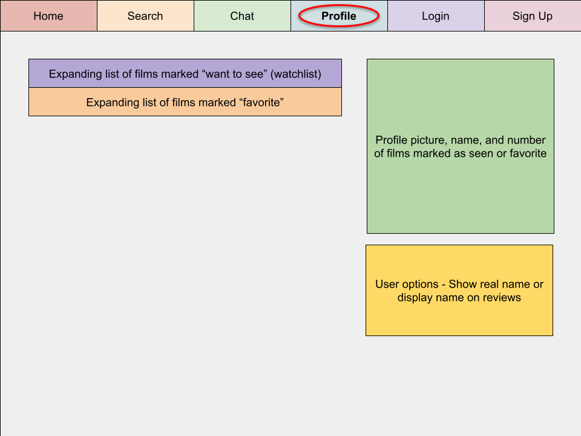
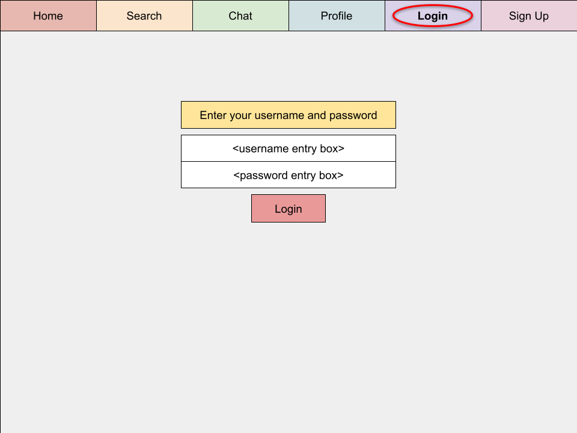
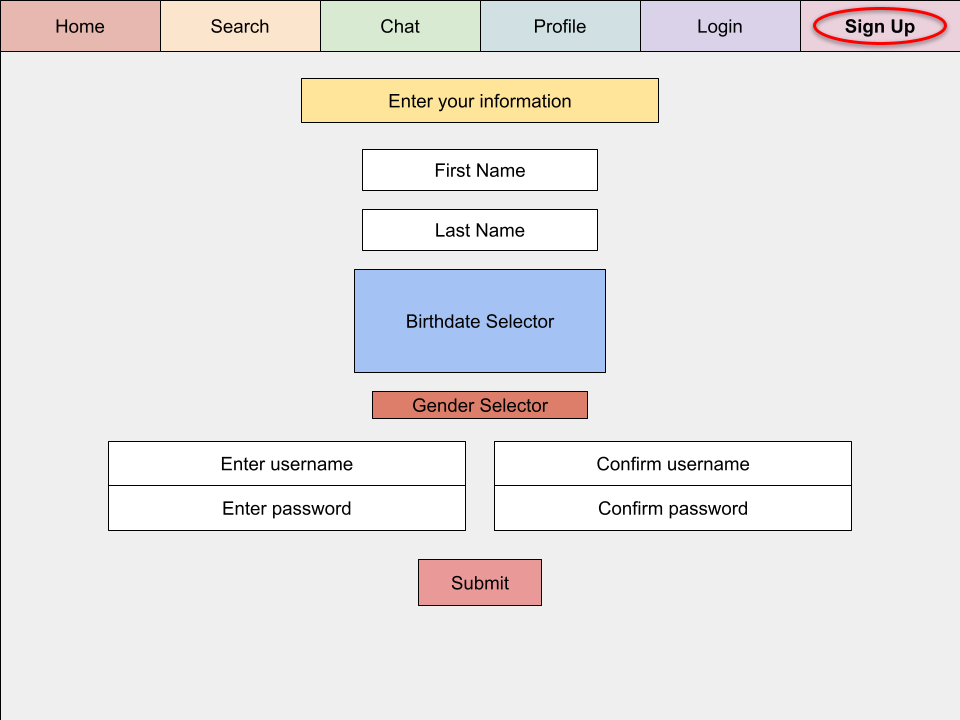

# Start-up: Film Hub

## Elevator Pitch

The one-stop shop for film nerds. You can find information about movies, read reviews, and even contribute your own reviews and chat with other users. You can also keep track of your favorite films, films you've watched, and films you want to see. The site will be connected to other useful sites such as Wikipedia, IMDB, RottenTomatoes, and Blu-ray.com.

## Design

### Home Page Rough Sketch

### Search Page Rough Sketch

### Chat Page Rough Sketch

### Profile Page Rough Sketch

### Login Page Rough Sketch

### Signup Page Rough Sketch

## Key Features

### Things anybody who visits the site can do
* Search any movie and go to its page
* See general information and reviews about it on this site
* See links to additional sites with more information about that film

### Things only logged in users can do
* Chat with other users
* Score a movie
* Write a text review for a movie
* Put movies on a watchlist and favorites list

## Technologies

* HTML - Site format, navigation at the top, page layout, entry forms
* CSS - Make everything look pretty
* JavaScript - Make everything functional (forms send to database or web APIs, response is returned and posted)
* Service - Will make use of both internal DB and external web services via API (IMDB, etc)
* DB - Store user information and movie reviews
* Login - Require users to login to contribute anything
* WebSocket - For chat area (users send messages to server, which gets forwarded to everyone who has the page open
* React - Porting website to react

## Extra features if I have time and can figure it out

* When logged in, login and signup button at the top go away and are replaced with a single "signout" button
* Require users to verify their email address
* Add more things on the home page
* Integrate with more websites

## Notes for Startup HTML assignment submission

* Created the basic HTML pages and populated them with the necessary forms, and some placeholder data where database accessing will occur
* Deployed startup to startup.filmhub.click and simon (with some small modifications) to simon.filmhub.click

## Startup CSS Deliverables

* Uploaded Simon CSS to simon.filmhub.click and checked out its code so I could incorporate ideas from that into my startup
* Revised the HTML structure of the website to better accomodate the structure and CSS I need
* Added a global CSS file for the entire site, that sets up the header and footer as constant and adaptive, with a center content that can scroll if it's taller than what's available
* Added CSS files for each individual page that render the main center content
* Got started on a tiny bit of JavaScript, what it does is highlight the navigation button corresponding to the page, like a tab, so it shows that instead of a page header title, which looks a lot nicer and is more intuitive

## Startup JavaScript Deliverables

* JavaScript support for future login - You can create an account on the signup page, login on the login page, and when you do, the chat and profile pages become available, and a logout button appears on the top to replace the login and signup buttons! This is all done with LocalStorage so it is not server-side.
* JavaScript support for future database data - If you search for films while logged in, two buttons appear to add the film to your favorites or watchlist! You can then go see those lists on your profile page, and remove the films from those lists if you want to! This is all done with LocalStorage so it is not server-side.
* JavaScript support for future WebSocket - If you are logged in, you can check out the chat page, which would normally show you logged in users and chat messages, but since we are using LocalStorage only for this part, you only see yourself logged in and only your own chat messages that you send! The chat messages are not saved once you reload the page. That will change once the backend works with websocket.
* JavaScript support for your application's interaction logic - The homepage is still curated, but now it loads the images and facts dynamically from an API request! The search function also works without logging in, and uses API requests to get data and populate a table of information. The other pages all use JavaScript to function as well.

## Startup Service Deliverables

* NodeJS and Express service has been created (see index.js)
* Frontend is served up using express (see index.js)
* Frontend calls third party endpoints (see public/scripts/search.js)
  - Third part API request to OMDB to get search results
* Backend provides service endpoints (see api_router.js and auth_router.js)
  | URL | HTTP Method | Requires Cookie? | Requires JSON Body? | Response Cookie? | Response JSON Body? | Description |
  | --- | ----------- | ---------------- | ------------------- | ---------------- | ------------------- | ----------- |
  | `/auth/signup` | POST | no | yes | no | no | Adds username and password to database |
  | `/auth/login` | POST | no | no | yes | no | If valid username and password, creates auth token and returns as cookie |
  | `/auth/logout` | DELETE | yes | no | yes | no | If valid auth token in cookie, removes it from server and sends back empty cookie |
  | `/auth/list` | GET | no | no | no | no | Debug feature, prints memory database to NodeJS console |
  | `/api/list/<list>` | GET | yes | no | no | yes | Returns JSON list (options are watchlist and favorites) |
  | `/api/exists/<list>` | GET | yes | yes | no | no | Checks if film in JSON request body exists in list (check HTTP response code) |
  | `/api/add/<list>` | POST | yes | yes | no | no | Adds film in JSON request body to list |
  | `/api/remove/<list>` | DELETE | yes | yes | no | no | Removes film in JSON request body from list |
* Frontend calls backend provided service endpoints (see X)
