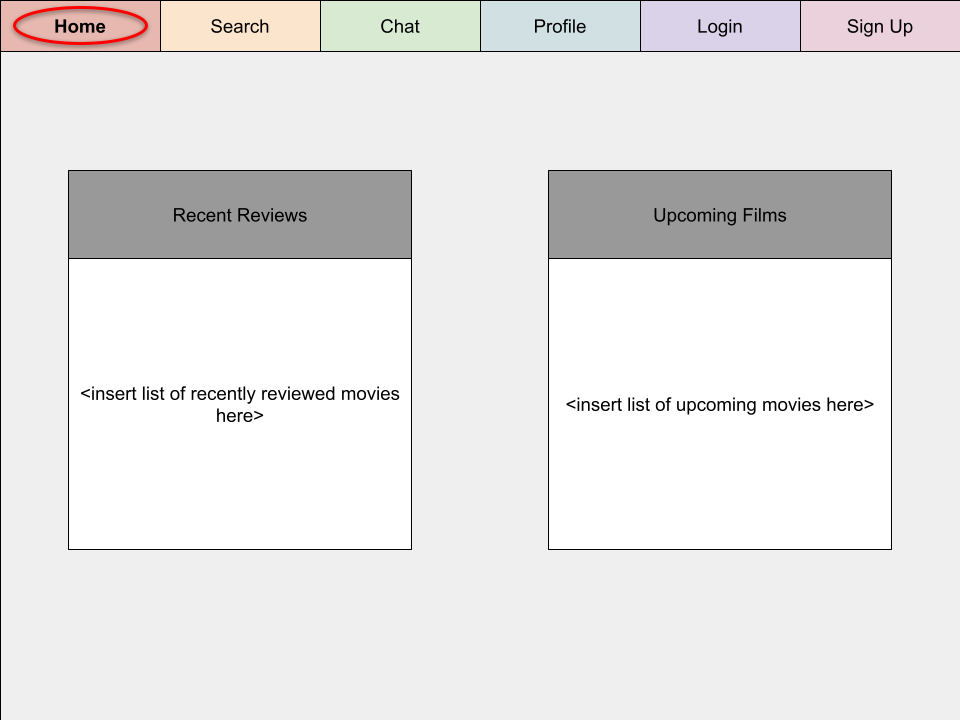
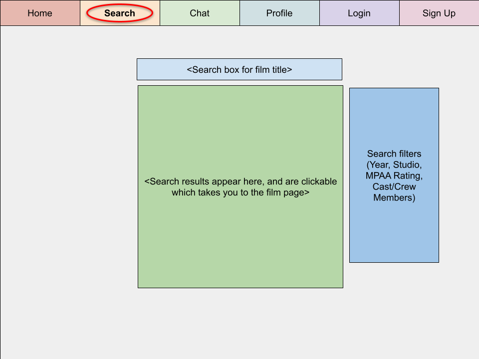
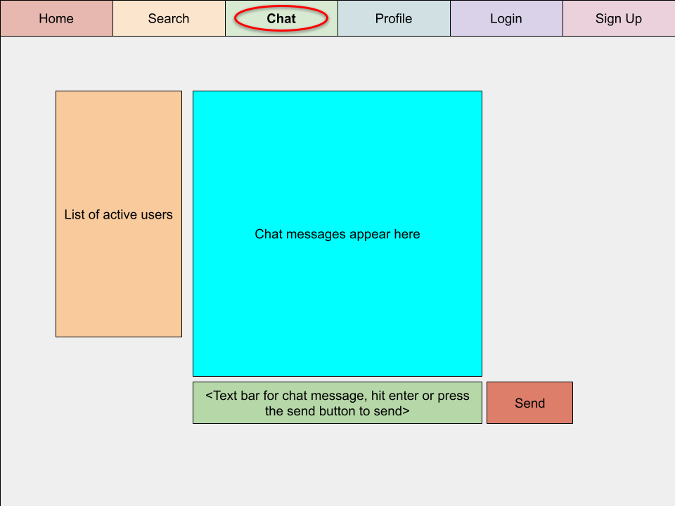
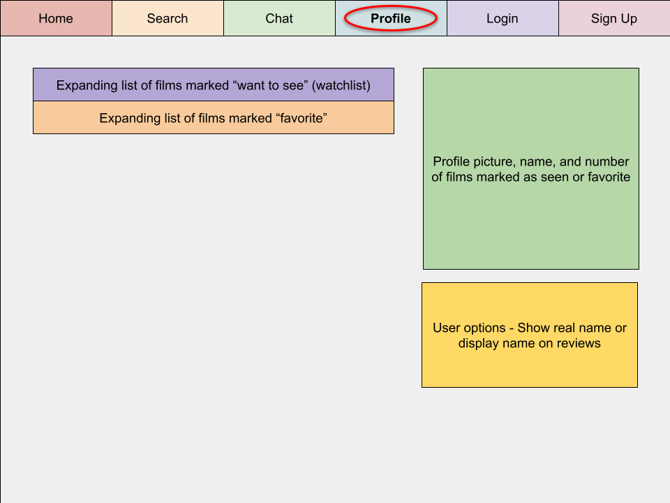
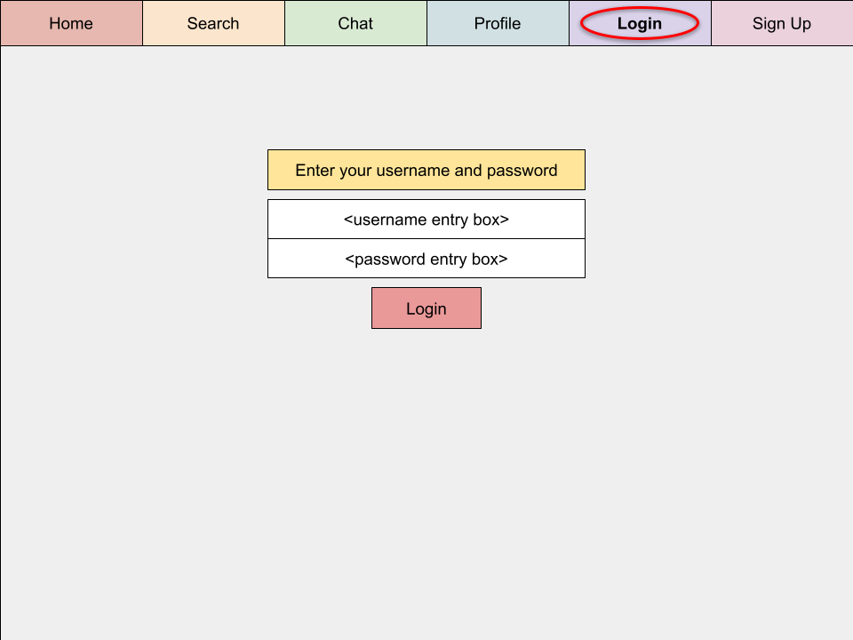
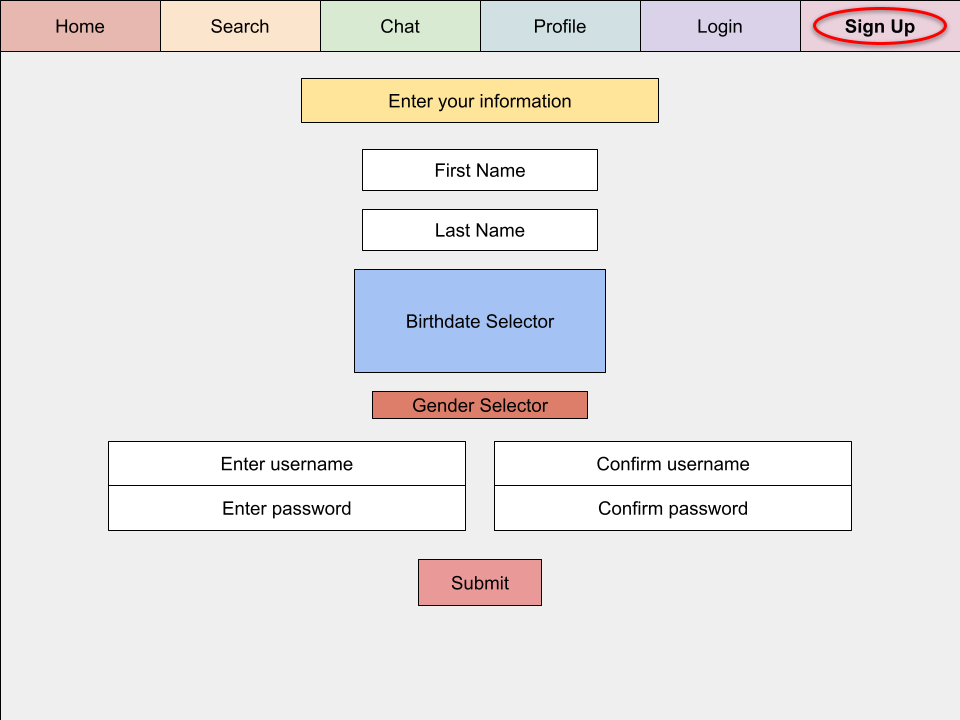

# Start-up: Film Hub

## Elevator Pitch

The one-stop shop for film nerds. You can find information about movies, read reviews, and even contribute your own reviews and chat with other users. You can also keep track of your favorite films, films you've watched, and films you want to see. The site will be connected to other useful sites such as Wikipedia, IMDB, RottenTomatoes, and Blu-ray.com.

## Design

### Home Page Rough Sketch

### Search Page Rough Sketch

### Chat Page Rough Sketch

### Profile Page Rough Sketch

### Login Page Rough Sketch

### Signup Page Rough Sketch

## Key Features

### Things anybody who visits the site can do
* Search any movie and go to its page
* See general information and reviews about it on this site
* See links to additional sites with more information about that film

### Things only logged in users can do
* Chat with other users
* Score a movie
* Write a text review for a movie
* Put movies on a watchlist and favorites list

## Technologies

* HTML - Site format, navigation at the top, page layout, entry forms
* CSS - Make everything look pretty
* JavaScript - Make everything functional (forms send to database or web APIs, response is returned and posted)
* Service - Will make use of both internal DB and external web services via API (IMDB, etc)
* DB - Store user information and movie reviews
* Login - Require users to login to contribute anything
* WebSocket - For chat area (users send messages to server, which gets forwarded to everyone who has the page open
* React - Porting website to react

## Extra features if I have time and can figure it out

* When logged in, login and signup button at the top go away and are replaced with a single "signout" button
* Require users to verify their email address
* Add more things on the home page
* Integrate with more websites

## Notes for Startup HTML assignment submission

* Created the basic HTML pages and populated them with the necessary forms, and some placeholder data where database accessing will occur
* Deployed startup to startup.filmhub.click and simon (with some small modifications) to simon.filmhub.click

## Startup CSS Deliverables

* Uploaded Simon CSS to simon.filmhub.click and checked out its code so I could incorporate ideas from that into my startup
* Revised the HTML structure of the website to better accomodate the structure and CSS I need
* Added a global CSS file for the entire site, that sets up the header and footer as constant and adaptive, with a center content that can scroll if it's taller than what's available
* Added CSS files for each individual page that render the main center content
* Got started on a tiny bit of JavaScript, what it does is highlight the navigation button corresponding to the page, like a tab, so it shows that instead of a page header title, which looks a lot nicer and is more intuitive

## Startup JavaScript Deliverables

* Application interaction logic - Search page now functions correctly! You can search a film title, or franchise name, and see every film on IMDB with those words in the title. You can also click the column headers to sort both directions, and play with the filter inputs to see things change!
